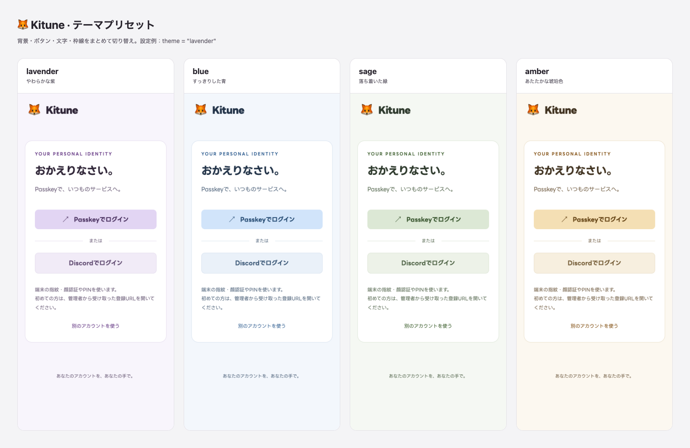

# Kitune

PasskeyとDiscordだけでログインする、個人用OIDC認証元。Better Auth 1.7.4・Hono 4.13.7・Bun 1.4.2・SQLiteで動作します。

シークレットを保持できるWebサービスは、自分のKitune（`id.example.com`）へ直接接続します。家族・サークルで複数の認証元を1つにまとめる場合だけ、共有Dexを任意で挟めます。[構成と役割分担](guides/federation.md)、[Fly配置手順](guides/deployment.md)、[ホストのリバースプロキシからのDocker配置](guides/reverse-proxy.md)を参照してください。

## はじめる

```sh
cp config.example.toml config.toml
cp .env.example .env
bun install --frozen-lockfile
```

`config.toml` のユーザー・クライアントと、`.env` の秘密値を設定します。`BETTER_AUTH_SECRET` と各クライアントシークレットには、`openssl rand -hex 32` などで個別に生成した値を使ってください。Bunが `.env` を読み込みます。

ローカルでは `http://localhost:3000` を開きます。PasskeyのRP IDにはIPアドレスを使えないため、`127.0.0.1` はIdPのoriginに指定できません。本番はHTTPSのドメインを使います。

`trusted_ip_source` は接続元IPを信頼する経路です。ローカル開発は `localhost`、Flyは `fly`（省略時の既定）、ホストのCaddy/Nginxは `reverse_proxy` を指定します。Kituneは選択した経路以外のヘッダーへ切り替えません。

```sh
bun run cli check-config
bun run dev
```

別のターミナルで `bun run cli enroll owner` を実行し、表示されたURLをブラウザで開いてPasskeyを登録します。登録URLは発行から15分間有効です。登録が完了すると再利用できなくなります。

Discordを使う場合は `users[].discord_ids` と環境変数 `DISCORD_CLIENT_ID` / `DISCORD_CLIENT_SECRET` を設定し、Discord Developer Portalに `{origin}/api/auth/callback/discord` を登録します。権限は `identify` のみで、メールやGuild情報は取得しません。

## 設定と認証

- 配色は `config.toml` のトップレベル（`[[users]]` より前）で `theme = "lavender"` のように選び、再起動して反映します。`lavender`（柔らかい紫）・`blue`（青）・`sage`（落ち着いた緑）・`amber`（暖色）の4種類があり、未指定時は `amber` です。ログイン・登録・アカウント・同意画面の背景、ボタン、文字、枠線を揃え、削除・エラー・警告の色は共通にしています。
- 任意色の `theme_color` は廃止しました。既存設定にある場合は削除し、`theme` でプリセットを選んでください。`theme_color` が残っている設定は起動時にエラーになります。
- 同じ `users[].discord_ids` に複数IDを置くと、どれでログインしても同じ `sub` になります。別ユーザーに割り当てると別の `sub` になります。Discord IDは文字列で指定します。
- ユーザーの固定 `id` はOIDCの `sub` です。メールはプロフィール属性で、ログイン・自動統合には使いません。メールはDB内で一意です。`email_verified` は管理者が確認した場合のみ `true` にします。
- ユーザー・クライアントの変更は設定を更新して再起動します。ユーザーの削除・無効化・属性・Discord紐付け変更で、そのユーザーのセッションとOAuth grantを失効させます。クライアント変更では、そのクライアントのgrantを失効させます。設定から削除したユーザーIDは再利用できません。一時停止には `enabled = false` を使います。
- Passkeyにはユーザー確認（UV）を要求し、サーバーでもUVなしの応答を拒否します。登録後はApple Passwords・1Passwordなどの保存先から名前を自動設定し、後から編集できます。判別できない場合は「Passkey」です。別のログイン方法がない最後のPasskeyは削除できません。
- `groups` はKituneでの所属グループです。各サービスが認可を実装します。家族側の権限を個人IdPが任意に与える仕組みにはしません。



## OIDC接続

シークレットを安全に保持できるWebサーバーごとに独立したクライアントIDとシークレットを発行し、Kituneへ直接接続します。SPA・ネイティブアプリ・公開クライアント・動的クライアント登録には対応しません。複数の認証元を選択させる家族・サークル用の共有Dexは、通常の機密クライアントとしてKituneへ直接接続できます。

issuerは `{origin}/api/auth`、Discoveryは `{origin}/api/auth/.well-known/openid-configuration` です。

対応スコープは `openid profile email groups offline_access`。認可コード、S256 PKCE、ローテーションに対応したリフレッシュトークンを提供します。`secret_env` と32文字以上のシークレットは全クライアントで必須です。認証方式は `client_secret_basic`（既定）と `client_secret_post` に対応します。

`[[clients]]` は複数設定できます。`require_pkce` を省略した場合は、S256方式のPKCEが必須です。PKCEを送信できない機密Webクライアントに限り、個別に `require_pkce = false` を設定できます。例外クライアントからS256 challengeが送られた場合もverifierを検証し、`plain` は拒否します。PKCEなしで `offline_access` を要求する場合は、`openid` と空でない `nonce` も必要です。

公開クライアントの `none`、`secret_env` の省略、必要な秘密値の欠落は起動時にエラーとなります。クライアント設定を変更すると、そのクライアントの未使用コードとgrantだけを失効させます。`require_pkce` を省略している既存クライアントは従来と同じfingerprintを維持するため、`require_pkce` の追加だけで一括失効は起きません。

ID／アクセストークンは15分、リフレッシュトークンは30日、認可コードは5分、Kituneのセッションは7日です。設定からの失効後も、外部サービスが既に作ったセッションやオフライン検証されるIDトークンは各期限まで残り得ます。

[Headscale 0.29.3・Gitea 1.27.3・Tailscaleの接続例](examples/web-services.md)と、任意の[家族](examples/family-dex.yaml)・[サークル](examples/circle-dex.yaml)共有Dex例を用意しています。直接接続時の `sub` はKituneに設定した固定ユーザーIDです。`groups` には `personal` などKituneで設定した値をそのまま返します。接続先変更時に、既存サービスの利用者をメール一致で自動移行しません。

## 管理・検証

| コマンド | 動作 |
| --- | --- |
| `bun run cli check-config` | 設定・必要な秘密値を検証。DBは変更しない |
| `bun run cli sync` | マイグレーションと設定同期 |
| `bun run cli enroll USER` | 最初のPasskey用URLを発行。既存Passkeyがあれば拒否 |
| `bun run cli recover USER` | Passkey・セッション・grantを失効させ、再登録URLを発行。Discord紐付けは維持 |
| `bun run cli revoke USER` | セッション・grantを失効。ログイン方法は維持 |
| `bun run cli revoke-all` | 全ユーザーのセッション・grantを失効 |
| `bun run cli backup PATH` | 設定同期をせず、一貫したSQLiteバックアップを新規ファイルへ作成 |

```sh
bun run check
bun test
bun run build
bun run test:production
bun run test:docker
DEX_BIN=/path/to/dex bun run test:dex
CHROMIUM_PATH=/path/to/chromium bun run test:ui
```

詳細は [開発・検証](guides/development.md) と [Fly運用・復元](guides/operations.md) を参照してください。

## Dockerパッケージ

GitHub ActionsはAMD64・ARM64それぞれのネイティブランナーでビルドとDocker統合テストを実行し、成功したイメージを `ghcr.io/glyzinie/kitune` に発行します。PRでは検証のみ実施します。

- `main` へのpush: `latest` と `sha-<commit SHA>`。
- `vX.Y.Z` タグへのpush: `X.Y.Z` と `sha-<commit SHA>`。プレリリースタグも利用できます。
- 手動実行: 指定したrefをビルド。`main` を指定すると `latest` も更新します。

公開処理にはリポジトリの `GITHUB_TOKEN` を使い、Flyの秘密値は不要です。初回発行後、GitHub Packagesのパッケージ設定でVisibilityがPublicになっていることを確認してください。Flyへのデプロイはこのworkflowから実行しません。

コンテナには `BETTER_AUTH_SECRET` とクライアント秘密値を環境変数で渡し、設定を `/app/config.toml`、永続Volumeを `/data` に配置します。実ユーザー設定・秘密値・DB・バックアップはイメージに含めません。

ホストのCaddy/Nginxから接続する場合は、コンテナの公開ポートを `127.0.0.1` に限定し、プロキシが単一の `X-Forwarded-For` を上書きする必要があります。具体例は[リバースプロキシ配置](guides/reverse-proxy.md)にあります。

## 紹介サイト

GitHub Pages向けの日本語サイトのソースは `site/` にあります。`bun run site:dev` で編集用プレビュー、`bun run site:preview` でビルド済みのサイトを確認できます。Actionsは `bun run site:build` で `site/dist/` を生成し、その内容を公開します。生成物はGitに含めません。[編集と公開の手順](guides/pages.md)を参照してください。

紹介サイトとアプリの日本語フォントには、Google FontsのCDNで配信されるLINE Seed JPを使用します。取得中やCDNに接続できない場合も、端末のフォントで表示します。

アプリのPasskey・プロフィール・端末・操作アイコンは [Google Material Symbols](https://developers.google.com/fonts/docs/material_symbols) のRounded（Apache License 2.0）をGoogle CDNから読み込みます。Discordは[公式ブランド素材](https://discord.com/branding)のClydeを、紹介サイトと同じ固定CDN URLで表示します。アイコンには操作名を併記します。アイコンを読み上げ対象から外し、併記した操作名を読み上げます。CDNに接続できない場合も、文字で操作を識別できます。
