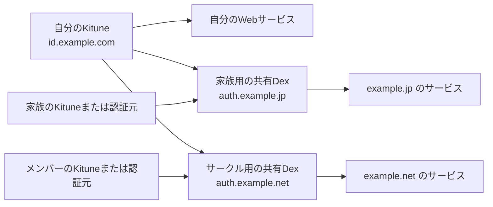

# Kituneとサービスの認証構成

シークレットを保持できるWebサービスは各人のKituneへ直接OIDC接続します。個人Dexは常用しません。家族・サークルで複数の認証元を1つにまとめる必要がある場合だけ、共有Dexを任意で配置します。

| 役割 | ドメイン例 |
| --- | --- |
| 自分のKitune | `id.example.com` |
| 自分のWebサービス | `headscale.example.com`、`gitea.example.com` |
| 家族用の共有Dex | `auth.example.jp` |
| サークル用の共有Dex | `auth.example.net` |

矢印は認証結果が渡る方向です。直接接続するサービスごとに、独立したクライアントIDとシークレットを発行します。

KituneはPasskey・Discordと固定ユーザーIDの対応、プロフィール、Kituneでの所属グループ、失効を管理します。共有Dexは参加者の認証元の選択と、共有サービスへのOIDC発行を担当します。共有Dexの導入・運用はKitune本体と独立しています。

## クライアントの境界

- 登録対象はシークレットを安全に保持できる機密Webクライアントだけです。SPA・ネイティブアプリ・公開クライアント・動的クライアント登録には対応しません。
- `secret_env` と32文字以上のシークレットは必須です。token endpointの認証方式は `client_secret_basic`（既定）または `client_secret_post` です。
- `require_pkce` は省略時に `true` として扱い、S256 PKCEを必須にします。PKCEを送信できない機密クライアントだけ、個別に `require_pkce = false` を指定します。
- PKCEを任意にしたクライアントでも、challengeが送られた場合はS256 verifierを検証します。`plain`、verifierの欠落・不一致、コード再利用、別クライアントからのコード交換は拒否します。
- PKCEなしで `offline_access` を要求する場合は、OIDC要求に `openid` と空でない `nonce` も必要です。更新が不要なサービスは基本スコープを `openid profile email` とし、`offline_access` を要求しません。
- ユーザー、Discord紐付け、クライアントは設定を唯一の管理元とします。クライアント設定の変更・削除ではそのクライアントのコードとgrantだけを失効させます。

OIDC処理はBetter Auth公式OAuth Providerプラグインへ委ねます。製品ごとの独自claimやプロトコル処理をKituneへ追加せず、Discovery、ID token、UserInfoの標準的な組み合わせで接続します。

## 直接接続

Kituneの本番originを `https://id.example.com` とすると、issuerは `https://id.example.com/api/auth`、Discoveryは `https://id.example.com/api/auth/.well-known/openid-configuration` です。

1. サービスごとにKituneの `[[clients]]` を追加し、別のID、シークレット用環境変数、callbackを設定する。
2. サービス側にはKituneのissuerまたはDiscovery URL、同じクライアントIDとシークレット、スコープ `openid profile email` を設定する。
3. サービスが対応している場合はS256 PKCEを有効にする。対応していない場合だけ、そのクライアントへ `require_pkce = false` を設定する。
4. Discovery、認可、コード交換、UserInfo、ログアウト後の再ログインを実際のサービスで確認する。

[Headscale 0.29.3・Gitea 1.27.3・Tailscaleの接続例](../examples/web-services.md)に、それぞれのcallback、PKCE条件、確認済みの範囲を記載しています。

## 家族・サークル用の共有Dex

[家族用](../examples/family-dex.yaml)と[サークル用](../examples/circle-dex.yaml)の例は、各参加者のKituneを共有Dexへ1段で接続します。Kitune側には共有Dexごとに別の機密クライアントを登録し、Dex connectorでは `offline_access`、S256 PKCE、UserInfo、グループ取得を有効にします。参加者ごとに固定connector ID、別のシークレット、別のグループ接頭辞を用意します。

`insecureEnableGroups` はOIDC connectorによるグループ取得を有効にするDexの設定名です。署名検証やTLS検証を省略する設定ではありません。未検証のメールは `email_verified=false` のまま扱います。Dex同士は循環接続しません。

## IDと権限の境界

Kituneへ直接接続したサービスが受け取る `sub` は、Kituneの設定にある固定ユーザーIDです。`groups` を要求した場合は `personal` などKituneに設定した元の値を受け取ります。サービスは利用者を `(issuer, sub)` で識別します。

共有Dexはconnector IDと上流 `sub` に基づく別の `sub` を発行します。例ではKituneの `personal` グループを、家族・サークルDexがそれぞれ `owner:personal` として発行します。この属性は参加者の認証元が申告した値です。共有サービスの利用許可や管理者権限は、接続元を含めたサービス側のポリシーで判定します。

個人Dex経由からKitune直接接続へ変えると、issuerと `sub` が変わります。メールが同じでも同一利用者として自動統合せず、サービスの管理機能で既存アカウントとの対応を明示的に移行します。既存セッション、ID token、サービス側のセッションはそれぞれの期限まで残る場合があるため、切替時は旧クライアントのgrantとサービス側セッションを必要に応じて失効させます。
