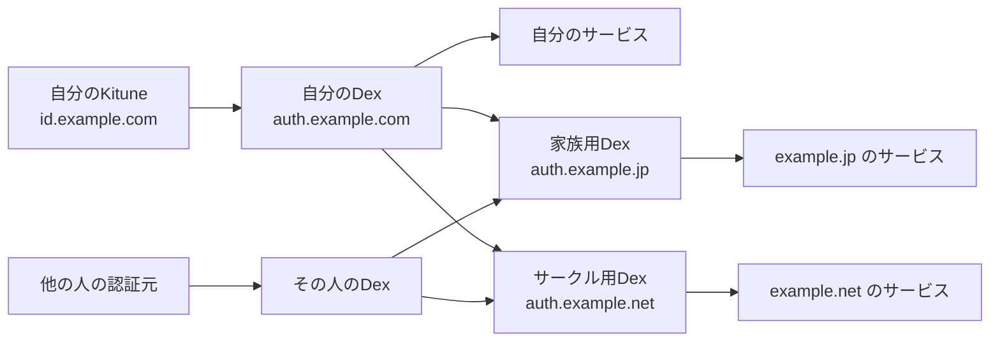

# 個人・家族・サークルの認証構成

各人が自分のDexを持ち、認証元の違いをそのDexでまとめます。家族・サークルのDexは、参加者それぞれのDexをOIDC connectorとして登録します。

| 役割 | 今回のドメイン例 |
| --- | --- |
| 自分の認証元Kitune | `id.example.com` |
| 自分のDex | `auth.example.com` |
| 家族のサービス | `example.jp` |
| 家族用Dex | `auth.example.jp` |
| サークルのサービス | `example.net` |
| サークル用Dex | `auth.example.net` |

矢印は認証結果が渡る方向です。個人サービスは自分のDex、家族・サークルのサービスはそれぞれのDexへOIDC接続します。

KituneはPasskey・Discordと固定ユーザーIDの対応を管理します。個人Dexは本人の認証元の選択・OIDCへの統一、家族／サークルDexは参加者の認証元の選択と各サービスへのOIDC発行を担当します。Kituneに加え、`deploy/dex/` に個人DexのFly配置用構成を用意しています。家族／サークルDexは接続設定例までです。[配置手順](deployment.md)を参照してください。

## サポート範囲

- Kituneは本人確認、固定ユーザーID、プロフィール・ローカルグループ、認証の失効を担当します。OIDC処理はBetter Auth公式OAuth Providerプラグインに委ね、仕様追従はライブラリ更新と接続テストで行います。
- 正式な検証対象はまずDexです。他の認証ブローカーは同じOIDC接続条件で検証してから対応対象へ追加します。接続相手の製品名を判別する独自制限は設けません。
- 各サービスとのOIDC互換性と下流クライアントの管理は個人Dexへ集約します。サービスのKituneへの直接接続は正式サポート対象外です。互換性問題はまずDexとサービス間で調査し、Kitune側の対応追加はブローカー接続に必要なものに限定します。
- `[[clients]]` は移行・検証・別ブローカー向けに複数対応を維持します。登録対象はsecretを安全に保持できる機密クライアントのみです。`secret_env` は必須、認証方式は `client_secret_basic`（既定）か `client_secret_post`、PKCEはS256必須とします。

## 接続設定

1. Kituneの本番originを `https://id.example.com` にする。issuerは `https://id.example.com/api/auth`。
2. Kituneに `personal-dex` クライアントを登録する。callbackは `https://auth.example.com/callback`。`PERSONAL_DEX_CLIENT_SECRET` を両者に渡す。
3. [個人Dexの例](../examples/dex.yaml)でKituneを認証元にし、家族／サークルDexを `staticClients` に登録する。
4. [家族Dexの例](../examples/family-dex.yaml)、[サークルDexの例](../examples/circle-dex.yaml)をそれぞれの構成に組み込む。参加者ごとに別のconnector IDとグループ接頭辞を用意する。

各段で `offline_access` を明示し、S256 PKCEとUserInfo取得を有効にします。`insecureEnableGroups` はOIDC connectorのグループ取得を有効にするDexの設定名です。署名検証・TLS検証を省略する設定ではありません。未検証のメールは `email_verified=false` のまま扱います。

## IDと権限の境界

Kituneの `sub` は設定の固定ユーザーIDです。各Dexはconnector IDと上流 `sub` に基づく別の `sub` を発行するため、各段でIDが変わりますが、構成を維持すれば再ログイン・更新でも安定します。同じ人でも家族DexとサークルDexのissuerは異なるので、サービスは `(issuer, sub)` で識別します。

Dexのconnector ID変更や認証元の切替は、同じメールでも同じ利用者として引き継がれるとは限りません。認証元を置き換える際は上流 `sub` の維持やサービス側の移行が必要です。Dex同士を循環して接続しません。

Kituneの置換時には、個人Dexのissuerとconnector IDを保ち、新しい製品が同じ上流ユーザーIDを返せるか確認します。できない場合はIDの対応を引き継ぐ方法を先に用意します。この構成はサービスの接続先変更を減らせますが、認証元のユーザーID移行まで自動化するものではありません。Kituneには家族／サークルのメンバー台帳やサービスごとの権限処理を追加しません。

Kituneの `personal` グループは、例では個人Dexで `kitune:personal`、家族／サークルDexで `owner:kitune:personal` になります。これはその参加者の認証元が発行した属性です。Dexは汎用のユーザー・グループ管理DBではないため、家族／サークル共通の役割や利用許可を、この属性からサービス側で明示的に判定します。

Kituneでの失効は、各Dexの上流への更新処理を通じて反映されます。DexのUserInfoは常にKituneの現在状態まで問い合わせるものではありません。Dexが既に発行したIDトークンやサービス自身のセッションが即時消える保証はありません。
